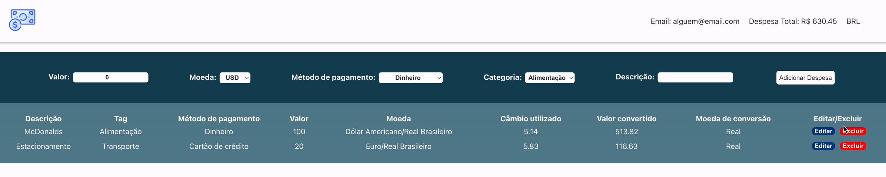
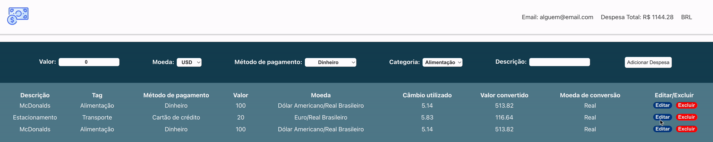

# Entregáveis

<details>
  <summary><strong>👨‍💻 O que deverá ser desenvolvido</strong></summary><br />

  Neste projeto você foi desenvolvido uma carteira de controle de gastos com conversor de moedas, ao utilizar essa aplicação um usuário deverá ser capaz de:

  - Adicionar, remover e editar um gasto;
  - Visualizar uma tabelas com seus gastos;
  - Visualizar o total de gastos convertidos para uma moeda de escolha;
</details>

<details>
  <summary><strong>:memo: Habilidades</strong></summary><br />

Neste projeto:

- Criar um _store_ Redux em aplicações React

- Criar _reducers_ no Redux em aplicações React

- Criar _actions_ no Redux em aplicações React

- Criar _dispatchers_ no Redux em aplicações React

- Conectar Redux aos componentes React

- Criar _actions_ assíncronas na sua aplicação React que faz uso de Redux.
</details>

# Requisitos

## Página de Login

Crie uma página para que a pessoa usuária se identifique, com email e senha. Esta página deve ser a página inicial de seu aplicativo.

<details><summary> Página de Login</summary>

  
</details><br />

## 1. Crie uma página inicial de login com os seguintes campos e características

* A rota para esta página deve ser `/`;

* <details><summary> Você deve criar um local para que a pessoa usuária insira seu e-mail e senha:</summary>

  - O campo para o e-mail precisa ter o atributo `data-testid="email-input"`;
  - O email precisa estar em um formato válido, como 'alguem@alguem.com';
  - O campo para a senha precisa ter o atributo `data-testid="password-input"`;
  - A senha precisa possuir 6 ou mais caracteres.
</details>

* <details><summary> Crie um botão com o texto <code>Entrar</code>:</summary>

  - O botão precisa estar **desabilitado** caso o e-mail não tenha um formato válido ou a senha possua um tamanho menor que 6 caracteres;

  - Salve o email no estado global da aplicação, com a chave **_email_**, assim que a pessoa usuária _logar_;

  - A rota deve ser mudada para `/carteira` após o clique no botão '**Entrar**'.
</details>

<br /><details>
  <summary><strong>O que será verificado</strong></summary><br />

- A rota para esta página é `"/"`
- É renderizado um elemento para que o usuário insira seu email e senha
- É renderizado um botão com o texto `"Entrar"`
- <details><summary> Foram realizadas as seguintes verificações nos campos de email, senha e botão:</summary>

  - É um e-mail no formato válido;
  - A senha tem 6 ou mais caracteres;
  - Desabilita o botão `Entrar` caso e-mail e/ou senha estiverem no formato inválido
  - Habilita o botão `Entrar` caso e-mail e senha sejam válidos
  </details><br />
- Salva o email no estado da aplicação, com a chave email, assim que o usuário logar
- A rota é alterada para `"/carteira"` após o clique no botão
</details>

---

## Página da Carteira

Crie uma página para gerenciar a carteira de gastos em diversas moedas e que traga a despesa total em real que é representado pelo código 'BRL'. Esta página deve ser renderizada por um componente chamado **_Wallet_**.

<details><summary> Página da carteira:</summary>
  
  
</details><br />

## 2. Crie uma página para sua carteira com as seguintes características

- A rota para esta página deve ser `/carteira`;

- O componente deve se chamar `Wallet` e estar localizado na pasta `src/pages`, no arquivo `Wallet.js`.

---

## Header

## 3. Crie um header para a página de carteira contendo as seguintes características

* <details><summary> Um elemento que exiba o e-mail da pessoa usuária que fez login:</summary>

  - Adicione o atributo `data-testid="email-field"`.

  - :bulb: **Dica**: você deve pegar o e-mail do estado global da aplicação (no Redux).
</details>

* <details><summary> Um elemento com a despesa total gerada pela lista de gastos:</summary>

  - Adicione o atributo `data-testid="total-field"` neste elemento;

  - Inicialmente esse elemento deve exibir o valor `0`;
</details>

* <details><summary> Um elemento que mostre qual câmbio está sendo utilizado, que neste caso será 'BRL':</summary>

  - Adicione o atributo `data-testid="header-currency-field"` neste elemento
</details><br />


---

## Formulário de adição de Despesa

## 4. Implemente a lógica para armazenar no estado global as siglas das moedas que vêm da API

* <details><summary> Os valores da chave <code>currencies</code> no estado global devem ser puxados através de uma requisição à API:</summary>
  
  - Essa requisição deve ser feita ao entrar na página `/carteira`, sendo representado pela sigla de cada moeda, exemplo: 'USD', 'CAD', 'EUR'...

  - O endpoint utilizado deve ser: https://economia.awesomeapi.com.br/json/all ;

  - Remova, das informações trazidas pela API, a opção 'USDT' (Moeda Tether);

  - A chave `currencies` do estado global deve ser um array.
</details><br />

---

## 5. Desenvolva um formulário para adicionar uma despesa contendo as seguintes características:

* O formulário deve ser renderizado dentro do componente `Wallet`;

* <details><summary> Um campo para adicionar valor da despesa:</summary>

  - Adicione o atributo `data-testid="value-input"`.
</details>

* <details><summary> Um campo para adicionar a descrição da despesa:</summary>

  - Adicione o atributo `data-testid="description-input"`.
</details>

* <details><summary> Um campo para selecionar em qual moeda será registrada a despesa.</summary>

  - O campo deve ter a label `Moeda`.

  - As options devem ser preenchidas pelo valor da chave `currencies` do estado global, implementada no requisito anterior.

  - O campo deve ser um `<select>`.
</details>

* <details><summary> Um campo para adicionar qual método de pagamento será utilizado.</summary>

  - Adicione o atributo `data-testid="method-input"`.

  - Este campo deve ser um `<select>`. A pessoa usuária deve poder escolher entre os campos: 'Dinheiro', 'Cartão de crédito' e 'Cartão de débito'.
</details>

* <details><summary> Um campo para selecionar uma categoria (tag) para a despesa.</summary>

  - Adicione o atributo `data-testid="tag-input"`.

  - Este campo deve ser um dropdown. a pessoa usuária deve poder escolher entre os campos: 'Alimentação', 'Lazer', 'Trabalho', 'Transporte' e 'Saúde'.

  - O campo deve ser um `<select>`.
</details><br />

<details><summary> Ilustração do formulário</summary>

  
</details><br />
---

## 6. Salve todas as informações do formulário no estado global

* Crie um botão com o texto \'Adicionar despesa\'. Ele servirá para salvar as informações da despesa no estado global e atualizar a soma de despesas no header.

* <details><summary> Desenvolva a funcionalidade do botão "Adicionar despesa" de modo que, ao clicar no botão, as seguintes ações sejam executadas:</summary>

  - <details><summary> Os valores dos campos devem ser salvos no estado da aplicação, na chave <b><i>expenses</i></b>, dentro de um array contendo todos gastos que serão adicionados:</summary>

    - O `id` da despesa **deve** ser um número sequencial, começando em 0. Ou seja: a primeira despesa terá id 0, a segunda terá id 1, a terceira id 2, e assim por diante.

    - **Você deverá salvar a cotação do câmbio feita no momento da adição** para ter esse dado quando for efetuar uma edição do gasto. Caso você não tenha essa informação salva, o valor da cotação trazida poderá ser diferente do obtido anteriormente.

    - :bulb: **Atenção nesse ponto**: você deverá fazer uma requisição para a API e buscar a cotação no momento que o botão de `Adicionar despesa` for apertado. Para isso você deve utilizar um thunk.
    </details>

  - <details><summary> Após adicionar a despesa:</summary>

    - Atualize a soma total das despesas (utilize a chave `ask` para realizar essa soma). Essa informação deve ficar no `header` dentro do elemento com `data-testid="total-field"`;

    - Limpe o valor do campo `valor da despesa`.
    </details>

  - <details><summary> As despesas salvas no Redux ficarão com um formato semelhante ao seguinte:</summary>

      ```javascript
      expenses: [{
        "id": 0,
        "value": "3",
        "description": "Hot Dog",
        "currency": "USD",
        "method": "Dinheiro",
        "tag": "Alimentação",
        "exchangeRates": {
          "USD": {
            "code": "USD",
            "name": "Dólar Comercial",
            "ask": "5.6208",
            ...
          },
          "CAD": {
            "code": "CAD",
            "name": "Dólar Canadense",
            "ask": "4.2313",
            ...
          },
          "EUR": {
            "code": "EUR",
            "name": "Euro",
            "ask": "6.6112",
            ...
          },
          "GBP": {
            "code": "GBP",
            "name": "Libra Esterlina",
            "ask": "7.2498",
            ...
          },
          "ARS": {
            "code": "ARS",
            "name": "Peso Argentino",
            "ask": "0.0729",
            ...
          },
          "BTC": {
            "code": "BTC",
            "name": "Bitcoin",
            "ask": "60299",
            ...
          },
          "LTC": {
            "code": "LTC",
            "name": "Litecoin",
            "ask": "261.69",
            ...
          },
          "JPY": {
            "code": "JPY",
            "name": "Iene Japonês",
            "ask": "0.05301",
            ...
          },
          "CHF": {
            "code": "CHF",
            "name": "Franco Suíço",
            "ask": "6.1297",
            ...
          },
          "AUD": {
            "code": "AUD",
            "name": "Dólar Australiano",
            "ask": "4.0124",
            ...
          },
          "CNY": {
            "code": "CNY",
            "name": "Yuan Chinês",
            "ask": "0.8278",
            ...
          },
          "ILS": {
            "code": "ILS",
            "name": "Novo Shekel Israelense",
            "ask": "1.6514",
            ...
          },
          "ETH": {
            "code": "ETH",
            "name": "Ethereum",
            "ask": "5184",
            ...
          },
          "XRP": {
            "code": "XRP",
            "name": "Ripple",
            "ask": "1.4",
            ...
          }
        }
      }]
      ```
    </details>
</details><br />
---

## Tabela de Gastos

## 7. Desenvolva uma tabela com os gastos contendo as seguintes características:

* <details><summary> A tabela deve possuir um cabeçalho com os seguintes valores:</summary>

    - Descrição;
    - Tag;
    - Método de pagamento;
    - Valor;
    - Moeda;
    - Câmbio utilizado;
    - Valor convertido;
    - Moeda de conversão;
    - Editar/Excluir.
</details><br />
---

## 8. Implemente a lógica para que a tabela seja alimentada pelo estado da aplicação

* <details><summary> A tabela deve ser alimentada pelo estado da aplicação, que estará disponível na chave <b><i>expenses</i></b> que vem do <i>reducer</i> <code>wallet</code>:</summary>

  - O campo de `Moeda` e `Moeda de Conversão` deverão conter o nome da moeda. Portanto, ao invés de 'USD' ou 'EUR', deve conter "Dólar Comercial" e "Euro", respectivamente;

  - Por padrão, o elemento que exibe a `Moeda de conversão` deverá ser sempre 'Real';

  - Atenção também às casas decimais dos campos. Como são valores contábeis, eles devem apresentar duas casas após a vírgula. Arredonde sua resposta somente na hora de renderizar o resultado e, para os cálculos, utilize sempre os valores vindos da API (utilize o campo `ask` que vem da API).

  - Utilize sempre o formato `0.00` (número - ponto - duas casas decimais).
</details><br />
---

## 9. Crie um botão para deletar uma despesa da tabela contendo as seguintes características:

<details><summary> Ilustração do botão</summary>

  
</details>

* O botão deve ser o último item da linha da tabela e deve possuir o atributo `data-testid="delete-btn"`.

* Ao ser clicado, o botão deleta a linha da tabela, alterando o estado global e o header.

<br /><details>
---

## 10. Crie um botão para editar uma despesa da tabela contendo as seguintes características:


<details><summary> Ilustração do botão</summary>

  
</details>

* O botão deve estar dentro do último item da linha da tabela e deve possuir `data-testid="edit-btn"`

* <details><summary> Ao ser clicado, o botão habilita um formulário para editar a linha da tabela. Ao clicar em "Editar despesa" ela é atualizada, alterando o estado global.</summary>

  - O formulário deverá ter os mesmos `data-testid` do formulário de adicionar despesa. Você pode reaproveitá-lo.

  - O botão para submeter a despesa para edição deverá conter **exatamente** o texto "Editar despesa"

  - Após a edição da despesa, a ordem das despesas na tabela precisa ser mantida.

  - :bulb: **Obs**: para esse requisito, não é necessário popular os inputs com os valores prévios da despesa. A imagem do gif é apenas uma sugestão. 

  - :bulb: Lembre-se de utilizar o formato do estado global da aplicação informado na seção <a href="#como-desenvolver">Desenvolvimento</a>

  - **Atenção**: o câmbio utilizado na edição deve ser o mesmo do cálculo feito na adição do gasto.
</details><br />

